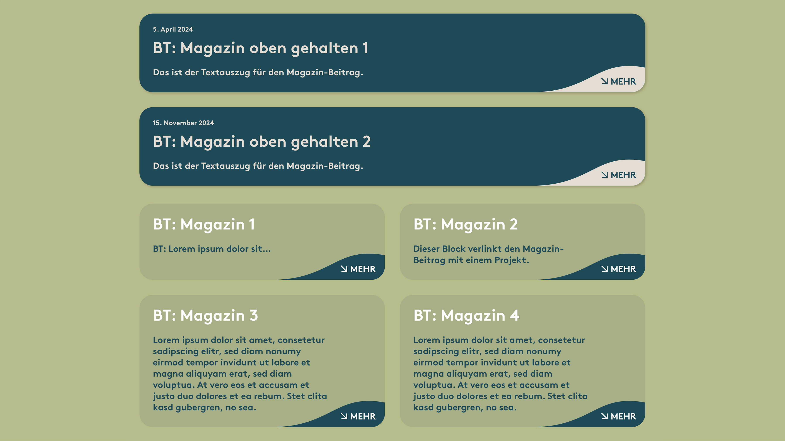
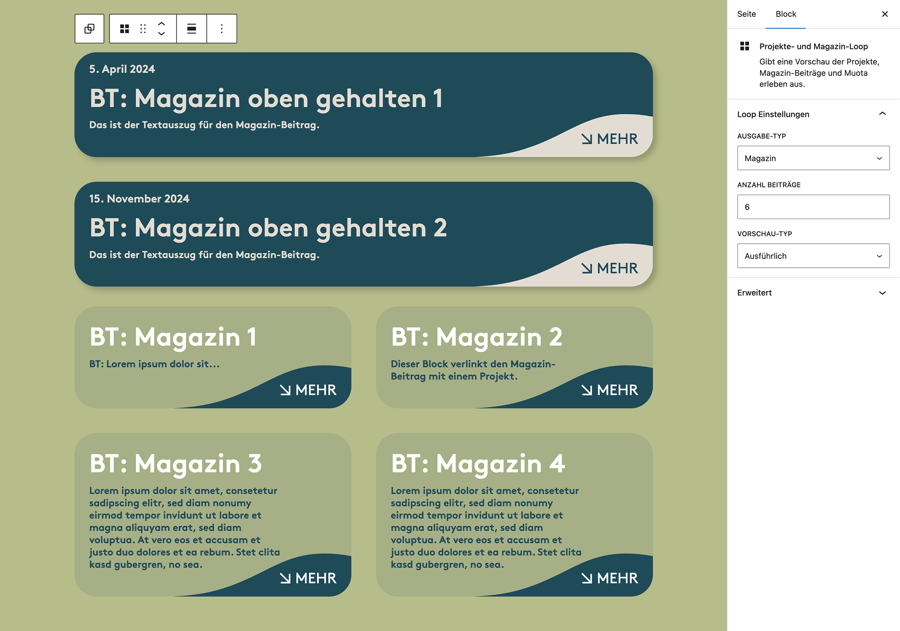

# UD Block: Projekte- und Magazin-Loop

Block zur dynamischen Darstellung von Projekten, Magazin-Beiträgen und *Muota erleben*-Inhalten.
Er kombiniert verschiedene Inhaltstypen in einer einheitlichen Loop-Struktur und erkennt automatisch den passenden Kontext.

## Funktionen

* **Kontextbasierte Inhaltserkennung**

  * Erkennt automatisch, ob der Block auf einer Projekt-, Magazin- oder Erlebnis-Seite steht.
  * Passt die Abfrage dynamisch an (`projekt`, `post`, `erleben`).

* **Flexible Ausgabe**

  * Zwei Layoutvarianten: **kompakt** (Bild & Titel) oder **ausführlich** (inkl. Textauszug).
  * Anzahl der Beiträge frei wählbar (Standard: 6).
  * Optional eigene Blocküberschrift (`title`).

* **Verknüpfungslogik**

  * Option **„nur verknüpfte Magazinbeiträge“** filtert Beiträge,
    die über Post-Meta mit dem aktuellen Projekt verbunden sind.
  * Ideal zur Darstellung thematisch verknüpfter Inhalte.

* **Editor-Integration**

  * Auswahl der Inhaltsquelle (`projekt`, `post`, `erleben`) über `SelectControl`.
  * Umschalten zwischen Vorschauvarianten (`kompakt` / `ausführlich`).
  * Echtzeit-Rendering im Editor über `ServerSideRender`.

## Screenshots

*Ausgabe der kombinierten Projekte- und Magazin-Loop.*

*Auswahl der Inhaltsquelle und Vorschau im Block-Editor.*

## 1. Sortierung, Anzeigeoptionen & Breakpoints

### Sortierung

* Standardmässig nach Veröffentlichungsdatum (`date`).
* Keine benutzerdefinierte Sortierlogik — die Abfrage richtet sich nach der gewählten `taxonomie` und der Option `nurVerknuepfteMagazinBeitraege`.
* Oben gehaltene (Sticky) Beiträge werden in einer separaten Abfrage zuerst ausgegeben und anschliessend von der Hauptabfrage ausgeschlossen. Dadurch erscheinen sie immer an erster Stelle im Loop, ohne doppelt angezeigt zu werden.

### Anzeigeoptionen

* Die Anzeigeart (`vorschau`) steuert das Template:

  * `kompakt` → reduzierte Vorschau mit Fokus auf Bild & Titel.
  * `ausführlich` → mit Auszug, Text und optionalen Zusatzfeldern.
* Der Titel des Blocks (`title`) wird nur ausgegeben, wenn gesetzt.

### Responsive Verhalten

* Das Layout ist responsive gestaltet.
* Anzahl und Anordnung der Loop-Elemente passen sich automatisch dem Viewport an.

## 2. Post-Types & Taxonomien

| Inhaltstyp / Taxonomie | Beschreibung                               |
|-------------------------|--------------------------------------------|
| `projekt`              | Projekte aus dem CPT „Projekt“             |
| `post`                 | Magazinbeiträge aus dem Standard-Post-Type |
| `erleben`              | Inhalte aus dem Bereich „Muota erleben“    |

## 3. Logik & Datenfluss

* Sticky-Posts (oben gehaltene Beiträge) werden über eine erste WP_Query abgefragt und ausgegeben, bevor die reguläre Hauptabfrage folgt. Diese Hauptabfrage schliesst Sticky-Posts explizit aus (`post__not_in`), um doppelte Darstellungen zu vermeiden.

## Autor

[ulrich.digital gmbh](https://ulrich.digital)

## Lizenz

GPL v2 or later
[https://www.gnu.org/licenses/gpl-2.0.html](https://www.gnu.org/licenses/gpl-2.0.html)

