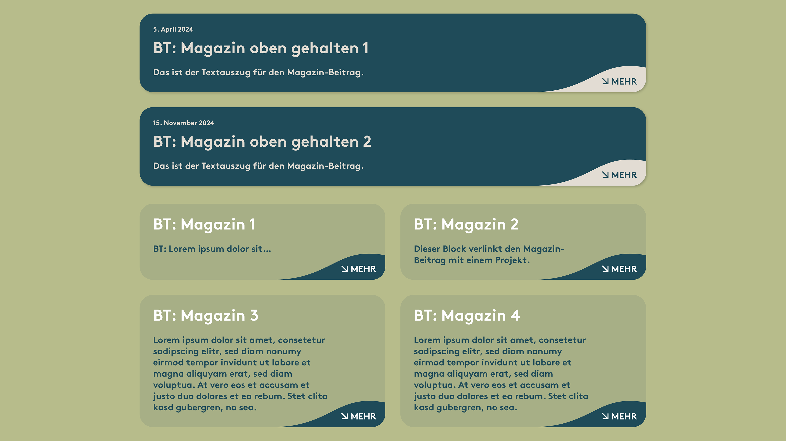
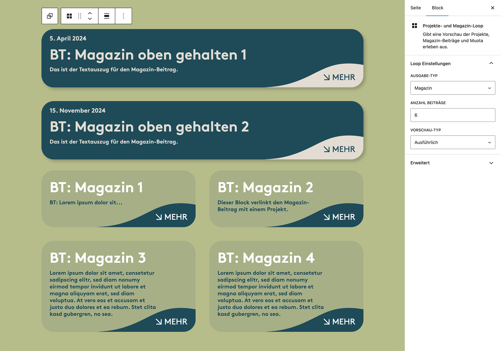

# UD Block: Projekte- und Magazin-Loop

Block zur dynamischen Darstellung von Projekten, Magazin-Beiträgen und *Muota erleben*-Inhalten.
Er kombiniert verschiedene Inhaltstypen in einer einheitlichen Loop-Struktur und erkennt automatisch den passenden Kontext.

---

## Funktionen

* **Kontextbasierte Inhaltserkennung**

  * Erkennt automatisch, ob der Block auf einer Projekt-, Magazin- oder Erlebnis-Seite steht.
  * Passt die Abfrage dynamisch an (`projekt`, `post`, `erleben`).

* **Flexible Ausgabe**

  * Zwei Layoutvarianten: **kompakt** (Bild & Titel) oder **ausführlich** (inkl. Textauszug).
  * Anzahl der Beiträge frei wählbar (Standard: 6).
  * Optional eigene Blocküberschrift (`title`).

* **Verknüpfungslogik**

  * Option **„nur verknüpfte Magazinbeiträge“** filtert Beiträge,
    die über Post-Meta mit dem aktuellen Projekt verbunden sind.
  * Ideal zur Darstellung thematisch verknüpfter Inhalte.

* **Editor-Integration**

  * Auswahl der Inhaltsquelle (`projekt`, `post`, `erleben`) über `SelectControl`.
  * Umschalten zwischen Vorschauvarianten (`kompakt` / `ausführlich`).
  * Echtzeit-Rendering im Editor über `ServerSideRender`.

---

## Screenshots
### Frontend-Ansicht

*Abbildung: Ausgabe der kombinierten Projekte- und Magazin-Loop.*

### Editor-Ansicht

*Abbildung: Auswahl der Inhaltsquelle und Vorschau im Block-Editor.*

---

## 1. Sortierung, Anzeigeoptionen & Breakpoints

### Sortierung

* Standardmässig nach Veröffentlichungsdatum (`date`).
* Keine benutzerdefinierte Sortierlogik — die Abfrage richtet sich nach der gewählten `taxonomie` und der Option `nurVerknuepfteMagazinBeitraege`.

### Anzeigeoptionen

* Die Anzeigeart (`vorschau`) steuert das Template:

  * `kompakt` → reduzierte Vorschau mit Fokus auf Bild & Titel.
  * `ausführlich` → mit Auszug, Text und optionalen Zusatzfeldern.
* Der Titel des Blocks (`title`) wird nur ausgegeben, wenn gesetzt.

### Responsive Verhalten

* Das Layout ist responsive gestaltet.
* Anzahl und Anordnung der Loop-Elemente passen sich automatisch dem Viewport an.

---

## 2. Post-Types & Taxonomien

| Inhaltstyp / Taxonomie | Beschreibung                               |
| ---------------------- | ------------------------------------------ |
| `projekt`              | Projekte aus dem CPT „Projekt“             |
| `post`                 | Magazinbeiträge aus dem Standard-Post-Type |
| `erleben`              | Inhalte aus dem Bereich „Muota erleben“    |

---

## 3. Logik & Datenfluss

* Der Block nutzt `WP_Query`, um Beiträge des gewählten Typs (`taxonomie`) abzurufen.
* Wenn `nurVerknuepfteMagazinBeitraege = true`, wird über `meta_query` oder `post_parent` nach Beiträgen gefiltert, die mit dem aktuellen Projekt in Beziehung stehen.
* Das Rendering erfolgt serverseitig (`render.php`), wodurch Inhalte jederzeit aktuell sind.
* Für jede Kombination aus `taxonomie` und `vorschau` existiert ein passendes Template-Fragment (z. B. `template-kompakt.php`, `template-ausfuehrlich.php`).

---

## 4. Editor-Integration

* **`edit.js`**

  * Dynamische Optionen für `taxonomie`, Vorschauart und Filter.
  * Vorschau wird via `ServerSideRender` direkt im Editor angezeigt.
  * UI-Komponenten: `SelectControl`, `ToggleControl`, `TextControl`.

---

## 5. Anforderungen

* WordPress ≥ 6.7
* PHP ≥ 7.4

---

## Autor

**ulrich.digital gmbh**
[https://ulrich.digital](https://ulrich.digital)

---

## Lizenz

GPL v2 or later
[https://www.gnu.org/licenses/gpl-2.0.html](https://www.gnu.org/licenses/gpl-2.0.html)
